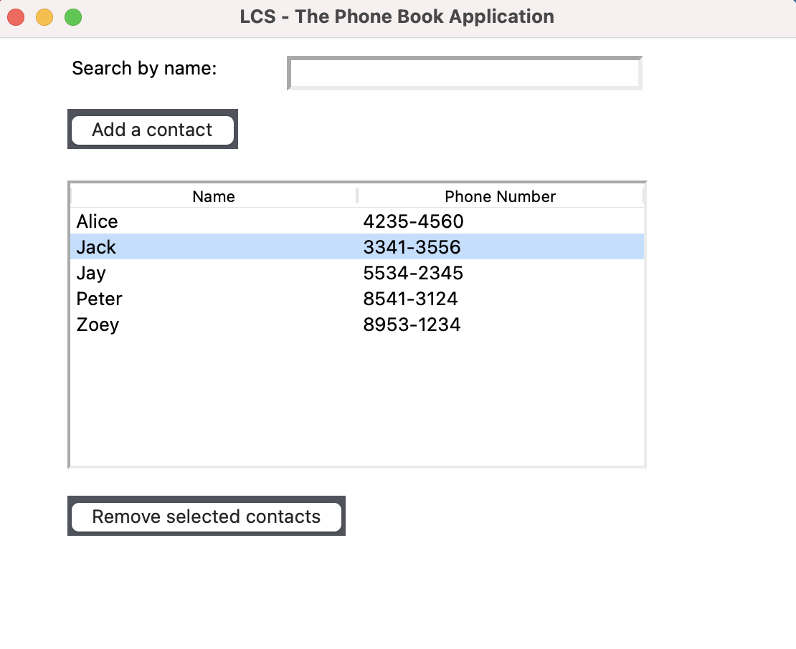
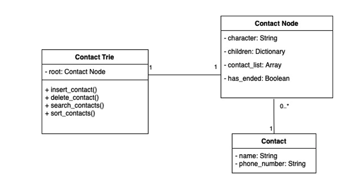

# The Phone Book Application



*The Phone Book Application screen capture*
## Table of Content
- [1 Background](#background)
- [2 Features](#features)
- [3 Quick Start](#quick-start)
  - [3.1 Environment](#quick-start-environment)
  - [3.2 Application Commands](#quick-start-application-commands)
- [4 The implementation of the PBA](#the-implementation-of-the-pba)
  - [4.1 The implementation of the Contact Class](#the-implementation-of-the-contact-class)
  - [4.2 The implementation of the Contact Trie Tree Node Class](#the-implementation-of-the-contact-trie-tree-node-class)
  - [4.3 The implementation of the Contact Trie Tree Class](#the-implementation-of-the-contact-trie-tree-class)
  - [4.4 The implementation of the Contacts Storage Class](#the-implementation-of-the-contacts-storage-class)
- [5 The functionalities of the PBA](#the-functionalities-of-the-pba)
  - [5.1 Provide a GUI to users](#the-functionalities-of-the-pba-provide-a-gui-to-users)
  - [5.2 Retrieve contact records from the temporary JSON file](#the-functionalities-of-the-pba-provide-a-gui-to-users)
  - [5.3 Search contact records](#the-functionalities-of-the-pba-retrieve-contact-records-from-the-temporary-json-file)
  - [5.4 Insert a new contact record](#the-functionalities-of-the-pba-insert-a-new-contact-record)
  - [5.5 Delete an existing contact record](#the-functionalities-of-the-pba-delete-an-existing-contact-record)
  - [5.6 Sort contact records](#the-functionalities-of-the-pba-sort-contact-records)

## 1 Background <a name="background"></a>

The Phone Book Application (PBA) is a desktop application implemented by pure Python 3.6.8 programming language. In this solution, we decided to implement the Trie Tree structure as the algorithm for searching contacts in the PBA. The Trie Tree structure stores each prefix as a leaf node and be resided in its tree structure. It facilitates us to search contacts quickly and efficiently without having inserted the full name of the contact person. Also, it has better performance during the insertion and discovery of leaf nodes inside its tree structure than the binary search tree structure.

## 2 Features <a name="features"></a>

1. Retrieve contact records from the temporary JSON file.
2. Insert, delete and search contact records.
3. Sort contact records by name in ascending/descending order.
4. Persist and purging contact records in the JSON file.

## 3 Quick Start <a name="quick-start"></a>

### 3.1 Environment <a name="quick-start-environment"></a>

```python
Python 3.6.8
```

### 3.2 Application Commands <a name="quick-start-application-commands"></a>

```python
python3 ./main.py
```

```python
python3 ./tests/*_test.py -v
```

## 4 The implementation of the PBA <a name="the-implementation-of-the-pba"></a>



Figure 4.0.1 The class diagram of the PBA

Figure 4.0.1 illustrates the relationship between each class in the PBA. There have three core classes in the PBA. The Contact Trie class is the definition of the Contact Trie Tree. It carries out operations of managing leaf nodes, searching leaf nodes, and sorting leaf nodes in its tree structure. The Contact Node class is the definition of the trie tree node. It contains the character and contact list in its state. The Contact class is the definition of the contact. It contains the contact person's information, such as name and phone number. 

### 4.1 The implementation of the Contact Class <a name="the-implementation-of-the-contact-class"></a>

```python
class Contact:
  """
    The contact object structure
  """

  def __init__(self, name, phone) -> None:
    """
      Initialize the contact object by constructor
    """
    self.name = name
    self.phone = phone

  def __str__(self) -> str:
    '''
      Overrides the __str__ method for the contact object
    '''
    return f'''
      Contact: (
        name: {self.name},
        phone: {self.phone},
      )
    '''
```

During the creation of the contact object, the PBA needs to provide name and phone attributes for initialization. The contact class stores those information in its state during executing the __init__ method. For the full code of the contact definition, please see [here](https://github.com/yinpinglai/lcs_the_phone_book_application/blob/master/definitions/contact.py).

### 4.2 The implementation of the Contact Trie Tree Node Class <a name="the-implementation-of-the-contact-trie-tree-node-class"></a>

```python
import json
from definitions.complex_json_encoder import ComplexJSONEncoder

class ContactTrieTreeNode:
  """
    The trie tree node of contact object structure
  """

  def __init__(self, character) -> None:
    """
      Initialize the contact trie tree object by constructor
    """
    self.character = character
    self.has_ended = False
    self.children = {}
    self.contact_list = []
  
  def __str__(self) -> str:
    """
      Overrides the __str__ method of the contact trie tree node object
    """
    return f'''
      ContactTreeNode: (
        character: {self.character},
        has_ended: {self.has_ended},
        children: {self.children},
        contact_list: {self.contact_list},
      )
    '''
```

During the initialization of the Contact Trie Tree Node object, the PBA needs to provide the character information to it. It takes the character and stores it inside its state. It also creates other attributes with default values during the initialization. The contact list holding all related contact records. The full code of the definition of the Contact Trie Tree Node, please see [here](https://github.com/yinpinglai/lcs_the_phone_book_application/blob/master/definitions/contact_trie_tree_node.py).

### 4.3 The implementation of the Contact Trie Tree Class <a name="the-implementation-of-the-contact-trie-tree-class"></a>

```python
from definitions.contact_trie_tree_node import ContactTrieTreeNode

class ContactTrieTree(object):
  """
    The contact trie tree object
  """

  def __init__(self) -> None:
    """
      Initializes the contact trie tree object by constructor
    """
    self.root = ContactTrieTreeNode('')

    for i in range(97, 123):
      self.root.children[chr(i)] = ContactTrieTreeNode(chr(i))
```

During the initialization, it does not need any parameter to pass in. It creates a root node with an empty character and stores it in its state. After the creation of the root node. It creates the children's leaf nodes from a-z alphabets. The child leaf node has not contained any information yet. It just builds the tree structure to prevent underlying operation problems. The full code of the definition of the Contact Trie Tree, please see [here](https://github.com/yinpinglai/lcs_the_phone_book_application/blob/master/definitions/contact_trie_tree.py).

### 4.4 The implementation of the Contacts Storage Class <a name="the-implementation-of-the-contacts-storage-class"></a>

```python
import os, json
from definitions.contact import Contact
from definitions.complex_json_encoder import ComplexJSONEncoder

PROJECT_PATH = os.path.dirname(os.path.abspath(__package__))

class ContactsStorage(object):
  '''
    The contacts storage object
  '''

  def __init__(self) -> None:
    '''
      Initializes the contacts storage object by constructor
    '''
    super().__init__()
    self.storage_filename = 'contacts.json'
    self.storage_filepath = os.path.join(PROJECT_PATH, 'tmp', self.storage_filename)
```

During the initialization, it fetches the temporary JSON file path by the os.path.join method. It stores the file path into the storage_filepath state. The contact storage object carries out the read/write operations for all contact records to the temporary JSON file. The full code of the definition of the Contacts Storage, please see [here](https://github.com/yinpinglai/lcs_the_phone_book_application/blob/master/definitions/contacts_storage.py).

## 5 The Functionalities of the PBA <a name="the-functionalities-of-the-pba"></a>

### 5.1 Provide a GUI to users <a name="the-functionalities-of-the-pba-provide-a-gui-to-users"></a>


Figure 4.1.1 The screenshot after starting up the PBA

By executing the command of starting the main application of the PBA in figure 3.2.1. Figure 4.1.1 reveals the main window of the PBA. This GUI is built by the [Tkinter](https://docs.python.org/3/library/tkinter.html) module of the Python programming language. It has an input of searching contacts, a button for creating a new contact record, a table showing all contact records, and a button for deleting selected contact records on the GUI window. It enables users to perform operations on their phone book through the GUI window. The GUI application manages the contact Trie Tree and contacts records in the JSON file storage.

```python
from tkinter import *

class PhoneBookApplication():
	def __init__(self) -> None:
		self.root = Tk()
		self.root.title('LCS - The Phone Book Application')
		self.root.gemetry('560x480')
		self.root.mainloop()
```

The Tkinter module provides a convenient way to create a GUI window. It is a built-in module of the Python programming language. As a result, we do not need to install any external packages into our solution. The full code of building the GUI window of PBA, please see [here](https://github.com/yinpinglai/lcs_the_phone_book_application/blob/master/definitions/application.py). 

### 5.2 Retrieve contact records from the temporary JSON file <a name="the-functionalities-of-the-pba-provide-a-gui-to-users"></a>

```python
# ... Other importions of required modules
from definitions.contact import Contact
from definitions.contacts_storage import ContactsStorage
from definitions.contact_trie_tree import ContactTrieTree

class PhoneBookApplication():
	def __init__(self) -> None:
		# ... Initialization of the GUI window
		self.contact_trie_tree = ContactTrieTree()
		self.contacts_storage = ContactStorage()
		self.initState()

	def init_state(self) -> None:
		retrieved_contacts = self.contacts_storage.retrieve_contacts_from_json()
    for contact in retrieved_contacts:
      self.contact_trie_tree.insert_contact(contact)
    self.contacts = retrieved_contacts
```

Figure 4.2.1 illustrates that the PBA loads all contact records from the temporary JSON file during the first time initialization. Since the PBA provides persistence of the contact records. As a result, users do not have to insert all the contact records after restarted the application every time. The PBA retrieves all contact records from the JSON file automatically. The full code of retrieving contact records during initialization, please see [here](https://github.com/yinpinglai/lcs_the_phone_book_application/blob/master/definitions/application.py#L25).

### 5.3 Search contact records <a name="the-functionalities-of-the-pba-retrieve-contact-records-from-the-temporary-json-file"></a>

```python
def search_contacts(self, keyword) -> list:
    '''
      Searches all contacts by matching the keyword

      Parameters:
        - keyword: The search term string

      Returns:
        - results: The list of all matched with the keyword's contacts
    '''
    if keyword == None or keyword == '':
      raise ValueError('Keyword is empty')

    def _find_nodes(node, prefix):
      '''
        Finds all nodes stored in the contact trie tree with the desired prefix string.

        Parameters:
          - node: Contact Trie Tree Node Object
          - prefix: The requested prefix string

        Returns:
          - results: An array of all contacts which matched with the desired prefix
      '''
      results = []
      if node.has_ended:
        results.extend(node.contact_list)

      node_children = list(node.children.values())
      for i in range(0, len(node_children)):
        child = node_children[i]
        results.extend(_find_nodes(child, prefix + node.character))
      return results

    results = []
    current_node = self.root
    for i in range(0, len(keyword)):
      character = keyword[i].lower()
      if character in current_node.children:
        current_node = current_node.children[character]
      else:
        return results
    results = _find_nodes(current_node, keyword[:-1])
    return results
```

Figure 5.3.1 illustrates the concrete of searching contacts by given keywords implementation. We followed the design of the searching contacts flow chart which is discussed in section 2.2.4 to implement it. The search contacts function takes the keyword as a parameter. It splits the keyword into every single character. It loops through each character to find related leaf nodes. The search function contains a sub-function called "_find_nodes". The sub-function finds all children recursively until it reaches the deepest leaf node.  

### 5.4 Insert a new contact record <a name="the-functionalities-of-the-pba-insert-a-new-contact-record"></a>

```python
def insert_contact(self, contact) -> bool:
    '''
      Inserts the contact object into the contact trie tree

      Parameters:
        - contact: The Contact object

      Returns:
        - has_performed: The boolean flag of whether the creation has been performed or not 
    '''
    if contact.name == None or contact.name == '':
      raise ValueError('The value of the name attribute is empty')

    current_node = self.root

    for character in contact.name.lower():
      if character in current_node.children:
        current_node = current_node.children[character]
      else:
        new_contact_node = ContactTrieTreeNode(character)
        current_node.children[character] = new_contact_node
        current_node = new_contact_node

    current_node.has_ended = True
    current_node.contact_list.append(contact)
    return True
```

Figure 5.4.1 illustrates the concrete implementation of inserting a new contact into the Contact Trie Tree. We followed the design of the contact insertion which we discussed in section 2.2.2 to implement. The insertion function takes a contact object as a parameter. It loops through each character of the name of the contact object to create a new leaf node into the Trie Tree when it does not exist. When it reaches the end of a leaf node, it appends the new contact into the contact list.

### 5.5 Delete an existing contact record <a name="the-functionalities-of-the-pba-delete-an-existing-contact-record"></a>

```python
def delete_contact(self, contact) -> bool:
    '''
      Deletes the contact object from the contact trie tree

      Parameters:
        - contact: The contact object

      Returns:
        - has_performed: The boolean flag of whether the deletion has been performed or not 
    '''
    if contact.name == None or contact.name == '':
      raise ValueError('The value of the name attribute is empty')

    def _remove_contact_trie_node(node, name, phone, idx) -> bool:
      '''
        Removes the contact trie tree node object from the contact trie tree

        Parameters:
          - children: The children nodes of the current trie tree node object
          - name: The name of the contact object
          - phone: The phone of the contact object
          - idx: The current index of the iteration

        Returns:
          - has_performed: The boolean flag of whether the deletion of the particular tire tree node object has been performed or not
      '''
      if idx == len(name):
        if node.has_ended:
          node.contact_list = list(filter(lambda c: c.phone != phone, node.contact_list))
          if len(node.contact_list) == 0:
            node.has_ended = True
            return True
        else:
          return False
      else:
        if name[idx] in node.children and _remove_contact_trie_node(node.children[name[idx]], name, phone, idx + 1):
          if len(node.children[name[idx]].children.keys()) == 0 and len(node.children[name[idx]].contact_list) == 0:
            if idx > 0:
              del node.children[name[idx]]
            return True
        else:
          return False

    current_node = self.root
    name = contact.name.lower()
    phone = contact.phone
    idx = 0
    return _remove_contact_trie_node(current_node, name, phone, idx)
```

Figure 5.5.1 illustrates the concrete implementation of deleting an existing contact from the Contact Trie Tree. We followed the design of the contact deletion which we designed in section 2.2.3. The deletion function takes a contact as a parameter. It loops through each character of the name of the contact to remove the contact from the contact list. In case there have no more children in the leaf node, it purges the leaf node from the Contact Trie Tree as well.

### 5.6 Sort contact records <a name="the-functionalities-of-the-pba-sort-contact-records"></a>

```python
def sort_contacts(self, contacts, order=1) -> list:
    '''
      Sorts all contacts in the list 

      Parameters:
        - contacts: A list of contacts
        - order: (optional) The order is used for determining the descending order while sorting the list. By default is 1. 1 equals ascending order. -1 equals descending order.

      Returns:
        - sorted_results: A sorted list of contacts
    '''
    if len(contacts) == 0:
      return contacts

    def _sort_by_name(contact) -> str:
      '''
        Retrieves the sorting key of the contact object
      '''
      return contact.name
    
    if order == 1:
      contacts.sort(key=_sort_by_name)
    elif order == -1:
      contacts.sort(key=_sort_by_name, reverse=True)
    return contacts
```

Figure 5.6.1 illustrates the concrete implementation of the contact records. It takes contacts and order as parameters. It sorts the contact records by the name of each contact order in ascending or descending order. It uses the built-in sort function of a list object to carry out the sorting of contact records.
